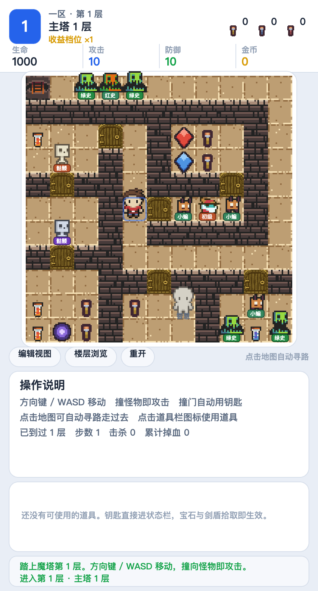

# mota50-wechat

类《魔塔》回合制 RPG —— **PixiJS 8 + TypeScript + Vite**，目标平台是**微信小游戏**。

数值、地图与剧情机制来自原版《魔塔 50 层》的考证与复刻；渲染层、交互层与全部工程代码为本项目原创。
界面**全部画在 canvas 上**，不使用 DOM —— 因为小游戏环境没有 DOM，原型阶段就这么做可以省掉上线前的整体重写。



---

## 当前状态

| 层 | 状态 |
|---|---|
| **数据层** | ✅ 51 层（`floor-00` ~ `floor-50`）、34 只怪物、32 件道具、12 种地形、6 位 NPC，均经交叉核对 |
| **规则层** | ✅ 战斗公式、钥匙经济学、商店档位、商人交易、卷轴/道具效果（`core/` 不依赖 PixiJS，可脱离画面单测） |
| **渲染层** | ✅ HUD + 11×11 棋盘 + 商店/商人/传送面板 + 楼层浏览模式；16×16 图集（CC0 素材） |
| **Web 端** | ✅ `npm run build` |
| **微信小游戏端** | ✅ `npm run build:minigame` → 单文件 `game.js`，1.8 MB / gzip 408 KB |
| **验证体系** | ✅ 数据校验 + 无 DOM 环境实测 + 真实 WebGL 渲染回归，全部脚本化 |
| **可玩性** | ⚠️ 数据层完备，但**剧情事件表尚未重建**：49→50 的传送未实现，故当前版本无法通关（见[已知缺口](#已知缺口)） |

---

## 快速开始

需要 **Node 18+**；资产管线需要 **Python 3.8+ 与 Pillow**。

```bash
npm install

# 可选：重建美术图集（assets/atlas/ 已入库，不改素材就不必跑）
python3 -m pip install pillow
npm run assets

npm run dev          # 开发服务器，浏览器打开后即可玩
```

点击棋盘寻路移动，方向键/`WASD` 也可直接走位；走到怪物、门、道具、NPC 上触发交互。

### 调试钩子

`npm run dev` 打开后，`window.mota.game` 上挂了若干钩子，用来跳过前置条件做单点验证：

| 钩子 | 作用 |
|---|---|
| `__probe()` | 引擎真值快照（层数、坐标、三围、金币、钥匙、背包、浮层状态） |
| `__goto(floor, x?, y?)` | 直接把勇者放到某层 |
| `__grant(id)` | 直接塞道具 / 给钥匙 |
| `__gold(n)` | 直接加减金币 |
| `__step(dir)` | 以代码方式走一步，等价于按方向键 |
| `__offers()` / `__shop()` | 当前层商人报价 / 商店报价，与面板所见**完全同源** |

---

## 目录结构

```
src/
  app.ts                 应用装配：HUD + 棋盘 + 面板的组装与事件路由
  data.ts                数据装载（data/*.json 的类型化入口）
  game/engine.ts         规则引擎：移动、战斗、开门、拾取、楼层切换
  game/state.ts          纯数据状态 + reducer（存档即 JSON.stringify）
  render/atlas.ts        图集与映射表读取、地形键归一、变体选择
  render/board.ts        11×11 棋盘绘制、实体视图（精灵 + 名牌）
  render/hud.ts          布局常量（LAYOUT）与状态栏
  render/icons.ts        图集缺失时的程序化矢量降级图形
  render/trade.ts        商店 / 商人面板
  minigame/              微信小游戏宿主：环境探测、wx 画布、Pixi 适配垫片
core/                    可独立运行的规则模块（战斗、商店），不依赖 PixiJS
data/                    游戏数据（派生自参考源码，见「授权」）
assets/
  raw/                   原始 CC0 素材包（9 个，只读）
  atlas/                 构建产出的图集（入库，可重建）
  MANIFEST.json          实体 → 图集坐标的唯一事实来源
  preview/               目视核对用的对照图（不参与运行）
tools/                   资产构建、数据导入、校验与截图取证脚本
docs/                    设计文档（见下表）
reference/mota50/        GPL-3.0 参考源码归档 + 溯源说明（不参与构建）
```

---

## 常用命令

| 命令 | 作用 |
|---|---|
| `npm run dev` | 开发服务器 |
| `npm run build` | 类型检查 + 生产构建（Web） |
| `npm run build:minigame` | 类型检查 + 构建微信小游戏产物 |
| `npm run assets` | 由 `assets/raw` 重建图集与 `MANIFEST.json` |
| `npm run import` | 由归档参考源码重建 `data/` |
| `npm run validate` | 数据校验器 |
| `npm run verify:minigame` | 无 DOM 环境实测（15 项判据，退出码 0/1） |
| `npm run verify:visual` | 真实 WebGL 渲染回归（8 项判据，退出码 0/1） |
| `npm run shot` | 真机渲染截图取证 |
| `npm run typecheck` | `tsc --noEmit` |

### 关于渲染验证

`verify:visual` 与 `shot` 需要 **Chromium**。它们先按 `PLAYWRIGHT_MODULES` 找 `playwright-core`，
再退回本项目 `node_modules`；找不到浏览器时请执行：

```bash
npx playwright install chromium
```

这两支脚本的价值在于**期望值在 Node 侧独立重实现一遍**再和浏览器里的实测对撞 ——
同一份源码派生两次不算验证。`verify:visual` 目前覆盖：

- 全塔 6171 格地形键与地图数据一致
- 69 面假墙（`w`）与同位置真墙走**同一条渲染规则**（隐藏通路不可被肉眼挑出）
- 479 只怪物脚不越格、每只恰好一个名牌
- 地形变体确实用满（地面 6 种 / 墙身 5 种 / 墙顶 5 种）

---

## 文档

| 文档 | 内容 |
|---|---|
| [`docs/mota50-numeric-system.md`](docs/mota50-numeric-system.md) | 原版数值体系：战斗公式、商店定价、钥匙经济学、领域夹击 |
| [`docs/data-spec.md`](docs/data-spec.md) | 数据格式规范：地形图例、实体、效果算子词汇表 |
| [`docs/ui-prototype.md`](docs/ui-prototype.md) | 界面层结构与实现、调试钩子、待办 |
| [`docs/wechat-minigame.md`](docs/wechat-minigame.md) | 小游戏适配：三种运行环境的差异与 API 替换 |
| [`docs/assets.md`](docs/assets.md) | 素材从哪来、怎么加工、运行时怎么用 |
| [`docs/source-review.md`](docs/source-review.md) | 参考源码调研与转换对照 |
| [`docs/known-gaps.md`](docs/known-gaps.md) | **数据缺口与待决策项（做运行时之前先看这份）** |
| [`assets/ATTRIBUTION.md`](assets/ATTRIBUTION.md) | 每一个像素的来源与授权 |
| [`reference/mota50/ATTRIBUTION.md`](reference/mota50/ATTRIBUTION.md) | 参考源码溯源、授权边界与已知缺陷 |

---

## 已知缺口

`docs/known-gaps.md` 记录了逐条核对过的数据缺口，其中三项在实现完整运行时前**必须先决策**：

- **三处区域边界通路缺少数据支撑**，其中 **49 → 50 未实现导致游戏无法通关**（楼梯图只在区域 BOSS 层断开）
- 参考实现的事件表只写完了前 10 层，11 层以后的楼层机制由攻略文字考证而来
- 部分内容在原版中由剧情或商人提供，参考源码从未放置（如真魔王、地震卷轴、对称飞行器）

界面层待办：**虚拟方向键与长按连续移动**尚未做（目前只有点击寻路与键盘）。
小游戏端当前是单文件产物，**分包加载未做**。

---

## 授权

本项目以 **GPL-3.0-only** 发布，全文见 [`LICENSE`](LICENSE)。

这不是随意选的，而是数据来源决定的：`data/floors/*.json`、`data/monsters.json`、`data/tiles.json`
等文件是从 GPL-3.0 的参考实现 `m8705/MAGIC-TOWER-JS` 转换而来。
**「转换成另一种格式」不构成「独立创作」**，派生数据按 GPL-3.0 的通例属于衍生作品，
因此整个项目随之以 GPL-3.0 分发。取舍的完整分析见
[`reference/mota50/ATTRIBUTION.md`](reference/mota50/ATTRIBUTION.md) §3。

需要注意的是 **GPL-3.0 不等于禁止商用**：可以商用，但要求衍生作品整体以 GPL-3.0 开源并附完整源码。
若计划闭源发布，则不能直接使用这批派生数据 —— 该文档 §3.4 列出了三条替代路径。

**美术素材则是干净的**：`assets/raw/` 下 9 个素材包**全部为 CC0**（公有领域，可商用、可修改、可再分发）。
项目刻意避开了任天堂 IP，逐包署名见 [`assets/ATTRIBUTION.md`](assets/ATTRIBUTION.md)。

**对白文本有意未复制**：参考源码中的智者提示与商人叫卖是创造性表达，
本项目只提取其中的事实性信息（如「第 27 层应达到 HP1500 / ATK80 / DEF98」），文案需自行撰写。

---

## 免责声明

《魔塔》系列原作版权归原作者所有。本项目是**非官方的技术复刻与学习性实现**，
不含原作任何美术与音频资源，不使用任何任天堂素材。
