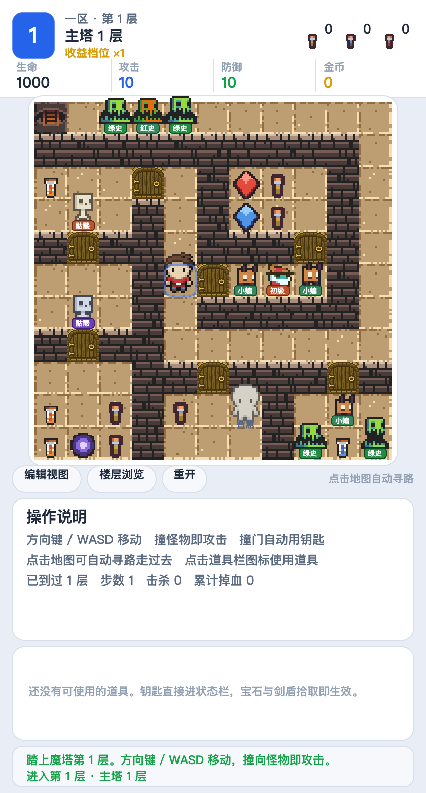

# mota50-wechat

类《魔塔》回合制 RPG —— **PixiJS 8 + TypeScript + Vite**，目标平台是**微信小游戏**。

数值、地图与剧情机制来自原版《魔塔 50 层》的考证与复刻；渲染层、交互层与全部工程代码为本项目原创。
界面**全部画在 canvas 上**，不使用 DOM —— 因为小游戏环境没有 DOM，原型阶段就这么做可以省掉上线前的整体重写。



---

## 当前状态

| 层 | 状态 |
|---|---|
| **数据层** | ✅ 51 层（`floor-00` ~ `floor-50`）、34 只怪物、32 件道具、12 种地形、6 位 NPC、**32 条事件**；两套独立参考源交叉核对（`reference/mota50/` + `reference/mota50-deluxe/`） |
| **规则层** | ✅ 战斗公式、钥匙经济学、商店档位、商人交易、卷轴/道具效果、`talked`/`enterTile` 等事件触发器（`core/` 不依赖 PixiJS，可脱离画面单测） |
| **渲染层** | ✅ HUD + 11×11 棋盘 + 商店/商人/传送面板 + 楼层浏览模式；64 网格手绘图集 + 8 张受管外部 BOSS 立绘（均 CC0）。BOSS 占位**逐只**：只有**巨龙 / 大乌贼**是 3×3（落屏 96px），其余 6 只与杂兵同为 **1 格**（落屏 32px） |
| **Web 端** | ✅ `npm run build` |
| **微信小游戏端** | ✅ `npm run build:minigame` → `game.js` 331 KB + `boot.js` 1.63 MB（+ `data/` 356 KB、`assets/` 436 KB） |
| **验证体系** | ✅ 五套回归 **109 条** + 自动通关 **48 条** + 构建期三套，全部脚本化（见[常用命令](#常用命令)） |
| **可玩性** | ✅ **可通关**：三处区域边界通路 + 封印解除 + 24→50 入口都已实现，`npm run validate` 39 项通过 / 1 项警告 |
| **自动通关（AI）** | ✅ 已接进界面（工具栏第三颗「自动通关 / 停止自动」）；**第一个 BOSS 已能自动击败**，当前最高到 F16，卡在 F15 的局势循环 |

> **两套参考源**：`reference/mota50/`（m8705/MAGIC-TOWER-JS）与 `reference/mota50-deluxe/`
> （h5mota 官方原版复刻数据）**不是同源**。凡是两源逐字相同的说法，可信度从「单一来源」
> 升为「交叉验证」；冲突之处以 `docs/known-gaps.md` 的逐条裁定为准。

---

## 快速开始

需要 **Node 18+**；资产管线需要 **Python 3.8+ 与 Pillow**。

```bash
npm install

# 可选：重建美术图集（assets/atlas/ 已入库，不改素材就不必跑）
python3 -m pip install pillow
npm run assets

npm run dev          # 开发服务器，浏览器打开后即可玩
```

点击棋盘寻路移动，方向键/`WASD` 也可直接走位；走到怪物、门、道具、NPC 上触发交互。

### 在微信开发者工具里跑（有四个必踩的坑）

```bash
npm run build:minigame        # 产出 dist-minigame/
```

然后在开发者工具**项目列表**里选**小游戏** → 导入 `dist-minigame`。
导入对话框的 AppID 请点旁边的「**或使用测试账号：小游戏**」，或填自己申请的小游戏 AppID。

**坑一：项目类型由 appid 决定，不由 `compileType` 决定。**
**不要填 `touristappid`**：那是**小程序**的游客号。开发者工具是按 appid 的 `gameApp`
属性决定项目类型的（`compileType` 只表达意图），appid 属于小程序侧时，工具会把工程
判成小程序、改去找 `app.json`，于是报「未找到 app.json，无法调试」——和产物本身无关。

**坑二：产物语法不能高于 ES2015。** 代码在上传/预览时会先过一遍微信**云端**的语法检查，
它不接受 ES2020 语法（可选链 `?.`、空合并 `??`），撞上了点「编译」立刻报：

```
task type:upload exec error Error: invalid file: game.js, 13:9
SyntaxError: Unexpected token .
```

所以 `vite.minigame.config.ts` 的 `build.target` 钉在 `es2015`（它只管**本地**打包，
管不到云端那一步 —— 这意味着本地 `verify:*` 全绿也发现不了它）。
`npm run verify:minigame` 里有一条判据专门守这个地板。

**坑三：IDE 模拟器里「编译」黑屏，可能不是产物本身的问题。**
微信开发者工具的模拟器是「有 wx 也有原生 DOM」的第四种环境：`document` / `navigator`
在 `window` 上是只读属性，产物里硬覆盖会抛 `TypeError`。
这个错误**不进 IDE 日志文件**，只出现在 IDE 控制台，所以看起来「没报错但画面全黑」。

`env.ts` 的做法是「能装则装、装不上就让路」，但关键是**按项判断，不能按宿主类型一刀切**：
`document` 在原生宿主上确有可用实现，就别碰；`navigator` 则只看**值可不可用**
—— 模拟器里它「存在但为 undefined」。第一版按「宿主类型」整体让路，
于是 `navigator` 被一并放掉，紧接着又死在
`Cannot destructure property 'userAgent' of '...getNavigator(...)' as it is undefined`。
`npm run verify:dom` 专门复现/断言这一类宿主。

**坑四：小游戏缺的全局会让整个包死在模块求值期。**
小游戏比浏览器少一批全局（`Intl` 就没有），而 Pixi 的「可选全局探测」经构建降级后
会**丢掉 `typeof` 的保护** —— 源码里的 `typeof Intl?.Segmenter === 'function'`
被 esbuild 降到 es2015 时改写成 `typeof (Intl == null ? void 0 : Intl.Segmenter) === 'function'`，
`Intl` 于是退回**裸标识符**：`typeof Intl` 本来不抛，`Intl == null` 会抛
`ReferenceError: Intl is not defined`。

这段代码在 `CanvasTextMetrics` 的**模块顶层静态字段**里执行，所以症状是
「一启动就死」+ 黑屏。`env.ts` 会把这些全局按需补齐；两个实测宿主也都会
**主动删掉它们再跑**（而且要求「真的删干净」，只置 `undefined` 会红 —— 否则判据变假绿）。

四个坑的复现、判定链路与自查命令，见
[`docs/wechat-minigame.md`](docs/wechat-minigame.md) 的「在微信开发者工具里打开」、
「验证：两种宿主，两套判据」与「语法地板」三节。

### 调试钩子

`npm run dev` 打开后，`window.mota.game` 上挂了若干钩子，用来跳过前置条件做单点验证：

| 钩子 | 作用 |
|---|---|
| `__probe()` | 引擎真值快照（层数、坐标、三围、金币、钥匙、背包、浮层状态） |
| `__goto(floor, x?, y?)` | 直接把勇者放到某层 |
| `__grant(id)` | 直接塞道具 / 给钥匙 |
| `__gold(n)` | 直接加减金币 |
| `__step(dir)` | 以代码方式走一步，等价于按方向键 |
| `__offers()` / `__shop()` | 当前层商人报价 / 商店报价，与面板所见**完全同源** |

---

## 目录结构

```
src/
  main.ts                引导 + 失败兜底
  app/                   应用装配：HUD + 棋盘 + 面板的组装与事件路由
  data/                  数据装载（data/*.json 的类型化入口）
                         ⚠️ 两套取数实现靠 @data-source alias 分开：
                         source-web.ts 构建期内联 / source-minigame.ts 运行期读代码包
  game/
    engine/              规则引擎：移动、战斗、开门、拾取、楼层切换、事件触发
    state.ts             纯数据状态 + reducer（存档即 JSON.stringify）
    dialogue.ts          NPC 对话
    score.ts             ★ 评分系统：道具/怪物/NPC **三套互不通用**的刻度
    autoplay.ts          自动通关的贪心决策器（纯函数，不认 Pixi）
    planner.ts           分阶段束搜索规划器（里程碑引导 + 钥匙硬约束）
    footprint.ts         实体占位块（BOSS 3×3）的单一来源
  render/
    atlas.ts             图集与映射表读取、地形键归一、变体选择
    board/               11×11 棋盘绘制、实体视图（精灵 + 名牌）
    hud/                 布局常量（LAYOUT）、状态栏与各面板
    backdrop.ts          场景背景层（上部星空 / 下部绝地）
    icons.ts             图集缺失时的程序化矢量降级图形
    trade.ts             商店 / 商人面板
  minigame/              微信小游戏宿主：环境探测、wx 画布、Pixi 适配垫片
core/                    可独立运行的规则模块（战斗、商店），不依赖 PixiJS
data/                    游戏数据（派生自参考源码，见「授权」）
  events.json            事件表（32 条）：区域通路 / 监牢 / 陷阱 / 守卫门 / 封印解除
  walkthrough.json       ★ 自动通关的攻略骨架：18 件里程碑 + 13 个阶段 + 幕（act）范围
tools/
  verify-autoplay.cjs    自动通关判据（48 条：骨架核对 + 一区事件 + 评分系统 + 整局模拟）
  autoplay/              headless 模拟 / 规划入口 / 攻略骨架读取 / 判据辅助模块
  probe-*.mjs            判据元测试（证明判据真的会红）与定向探针
  audit-*.mjs            事件缺口与特殊门的审计（`npm run audit`）
assets/
  raw/                   原始 CC0 素材包（9 个，只读）
  atlas/                 构建产出的图集（入库，可重建）
  MANIFEST.json          实体 → 图集坐标的唯一事实来源
  preview/               目视核对用的对照图（不参与运行）
tools/                   资产构建、数据导入、校验与截图取证脚本
docs/                    设计文档（见下表）
reference/mota50/        GPL-3.0 参考源码归档（m8705）+ 溯源说明（不参与构建）
reference/mota50-deluxe/ 第二参考源（h5mota 官方复刻数据）—— 与上者**不同源**，用于交叉验证
dist/                    网页端产物（不入库）
dist-minigame/           小游戏产物（不入库）：game.js 入口 + boot.js 库 + data/ + assets/
```

---

## 常用命令

| 命令 | 作用 |
|---|---|
| `npm run dev` | 开发服务器 |
| `npm run build` | 类型检查 + 生产构建（Web） |
| `npm run build:minigame` | 类型检查 + 构建微信小游戏产物 |
| `npm run assets` | 由 `assets/raw` 重建图集与 `MANIFEST.json` |
| `npm run import` | 由归档参考源码重建 `data/` |
| `npm run validate` | 数据校验器 |
| `npm run verify:minigame` | 无 DOM 环境实测（37 项常驻判据；取证构建下另加 6 项 = 43，退出码 0/1） |
| `npm run verify:dom` | 有原生 DOM 宿主实测（20 项判据，退出码 0/1） |
| `npm run verify:all` | 五套一键跑完（`sandbox` 14 + `visual` 36 + `minigame` 37 + `dom` 20 + `url-shim` 2 = 109） |
| `npm run verify:visual` | 真实 WebGL 渲染回归（36 项判据 = A1–A25 + A1b，退出码 0/1） |
| `npm run verify:autoplay` | **自动通关判据**（48 条：骨架交叉核对 + 一区事件 + 评分系统 + 整局模拟） |
| `npm run autoplay` | 跑一局无人操作的 headless 模拟（`--json` / `--verbose` / `--floor N` 诊断） |
| `npm run autoplay:plan` | 分阶段规划 / 单层诊断：`--phases`（按幕）`--scores`（三类分数）`--reach`/`--targets` |
| `npm run audit` | `validate` + 特殊门审计 + 事件缺口审计（一次跑完三支） |
| `npm run connectivity` | 全塔楼层连通性（抓「塔在某层断掉」这类结构性问题） |
| `npm run probe:*` | 判据元测试：证明某条判据**真的会红**（见 `.workbuddy/memory` 铁律 #38） |
| `npm run shot` | 真机渲染截图取证 |
| `npm run typecheck` | `tsc --noEmit` |

### 关于渲染验证

`verify:visual` 与 `shot` 需要 **Chromium**。它们先按 `PLAYWRIGHT_MODULES` 找 `playwright-core`，
再退回本项目 `node_modules`；找不到浏览器时请执行：

```bash
npx playwright install chromium
```

这两支脚本的价值在于**期望值在 Node 侧独立重实现一遍**再和浏览器里的实测对撞 ——
同一份源码派生两次不算验证。`verify:visual` 目前覆盖：

- 全塔 6171 格地形键与地图数据一致
- 69 面假墙（`w`）与同位置真墙走**同一条渲染规则**（隐藏通路不可被肉眼挑出）
- 479 只怪物脚不越格、每只恰好一个名牌
- 地形变体确实用满（地面 6 种 / 墙身 5 种 / 墙顶 5 种）

---

## 文档

| 文档 | 内容 |
|---|---|
| [`docs/mota50-numeric-system.md`](docs/mota50-numeric-system.md) | 原版数值体系：战斗公式、商店定价、钥匙经济学、领域夹击 |
| [`docs/data-spec.md`](docs/data-spec.md) | 数据格式规范：地形图例、实体、效果算子词汇表 |
| [`docs/ui-prototype.md`](docs/ui-prototype.md) | 界面层结构与实现、调试钩子、待办 |
| [`docs/wechat-minigame.md`](docs/wechat-minigame.md) | 小游戏适配：三种运行环境的差异、API 替换，**开发者工具导入（项目类型由 appid 决定）**、**产物语法地板** |
| [`docs/assets.md`](docs/assets.md) | 素材从哪来、怎么加工、运行时怎么用 |
| [`docs/source-review.md`](docs/source-review.md) | 参考源码调研与转换对照 |
| [`docs/known-gaps.md`](docs/known-gaps.md) | **数据缺口与待决策项（做运行时之前先看这份）** |
| [`assets/ATTRIBUTION.md`](assets/ATTRIBUTION.md) | 每一个像素的来源与授权 |
| [`reference/mota50/ATTRIBUTION.md`](reference/mota50/ATTRIBUTION.md) | 参考源码溯源、授权边界与已知缺陷 |

---

## 已知缺口

逐条核对过的缺口、以及**两套参考源冲突处的裁定**，全部记在
[`docs/known-gaps.md`](docs/known-gaps.md)。当前状态是「数据可用，1 项警告」，
警告是黄钥匙口径与社区基准帖差 15.7%（成因已查明：基准帖把商人出售的钥匙算进去了）。

仍然开着的口子按来路分三类：

- **参考实现自身没写完**（m8705 只把 `eventHappened[0..7]` 写到一区）—— 11 层以后靠攻略文字
  与第二参考源补齐。结构性问题（「塔在某层断掉」）由 `npm run connectivity` 兜底：
  **当前每一层的上楼梯都够得着，地形上没有堵点**（F49/F50 是终点层，本就没有向上出口）；
- **原版由剧情/商人提供、地图上没有实体**（真魔王、地震卷轴、对称飞行器、屠龙剑）——
  已按 `docs/known-gaps.md` 逐条裁定，走事件表而不是改地图；
- **本项目的主动改造**（如第 30 层单向、三区内容密度低）—— 明确标为设计变更，不算修正错误。

界面层待办：**虚拟方向键与长按连续移动**尚未做（目前只有点击寻路与键盘）。
小游戏端**分包加载未做**（`data/` 与 `assets/` 已在代码包内，但 JS 仍是两个文件）。

---

## 授权

本项目以 **GPL-3.0-only** 发布，全文见 [`LICENSE`](LICENSE)。

这不是随意选的，而是数据来源决定的：`data/floors/*.json`、`data/monsters.json`、`data/tiles.json`
等文件是从 GPL-3.0 的参考实现 `m8705/MAGIC-TOWER-JS` 转换而来。
**「转换成另一种格式」不构成「独立创作」**，派生数据按 GPL-3.0 的通例属于衍生作品，
因此整个项目随之以 GPL-3.0 分发。取舍的完整分析见
[`reference/mota50/ATTRIBUTION.md`](reference/mota50/ATTRIBUTION.md) §3。

需要注意的是 **GPL-3.0 不等于禁止商用**：可以商用，但要求衍生作品整体以 GPL-3.0 开源并附完整源码。
若计划闭源发布，则不能直接使用这批派生数据 —— 该文档 §3.4 列出了三条替代路径。

**美术素材则是干净的**：`assets/raw/` 下 9 个素材包**全部为 CC0**（公有领域，可商用、可修改、可再分发）。
项目刻意避开了任天堂 IP，逐包署名见 [`assets/ATTRIBUTION.md`](assets/ATTRIBUTION.md)。

**对白文本有意未复制**：参考源码中的智者提示与商人叫卖是创造性表达，
本项目只提取其中的事实性信息（如「第 27 层应达到 HP1500 / ATK80 / DEF98」），文案需自行撰写。

---

## 免责声明

《魔塔》系列原作版权归原作者所有。本项目是**非官方的技术复刻与学习性实现**，
不含原作任何美术与音频资源，不使用任何任天堂素材。
